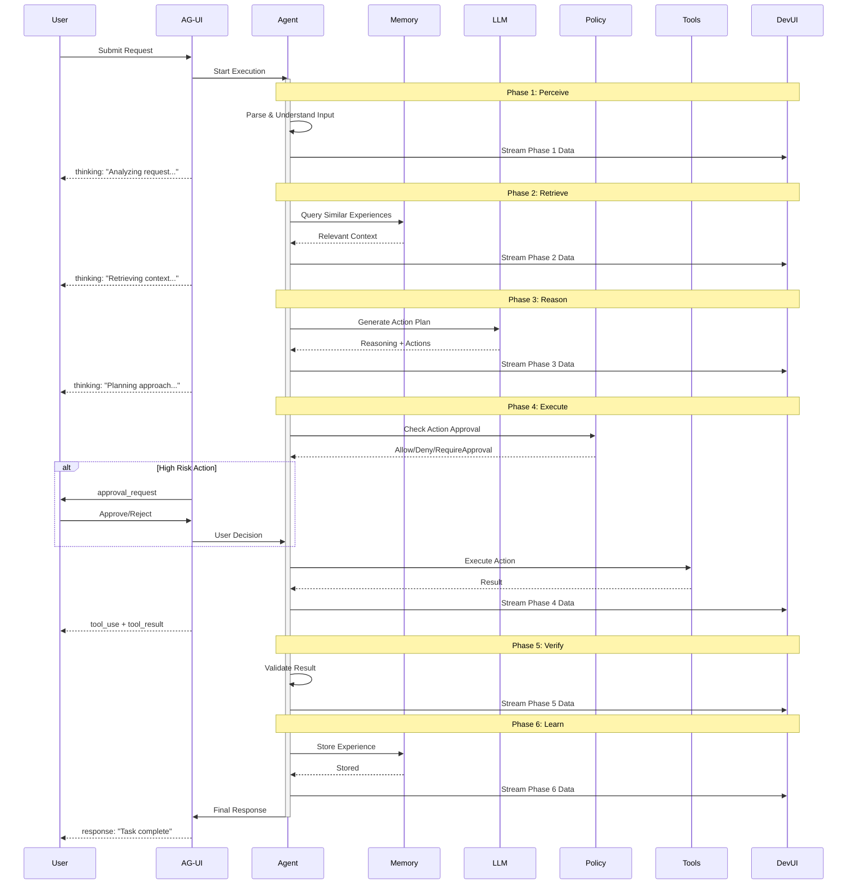
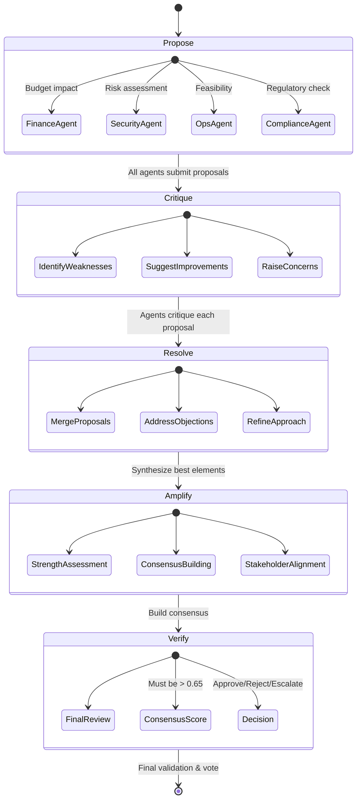
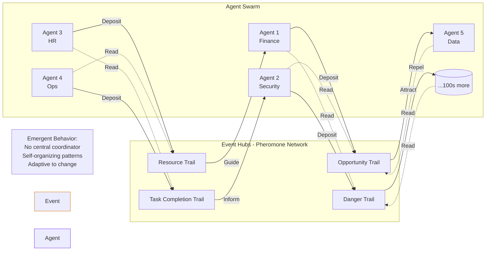
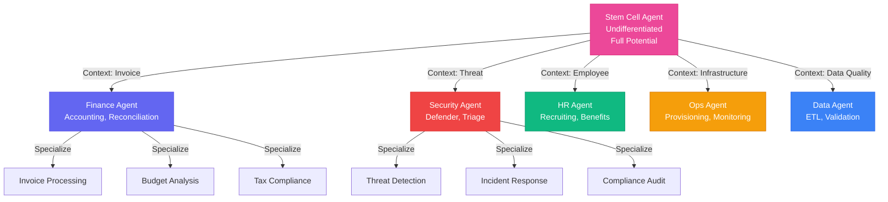
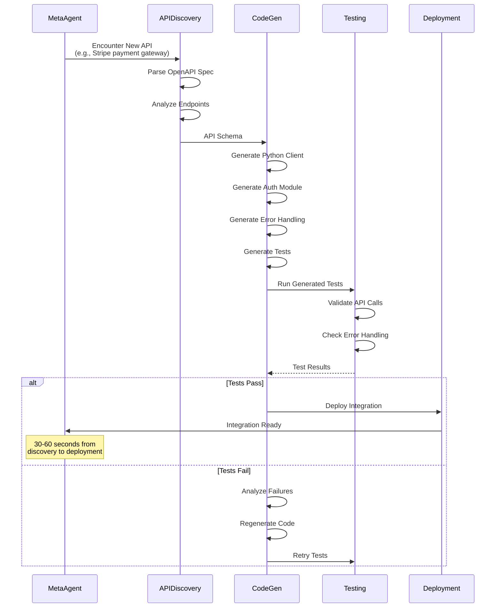
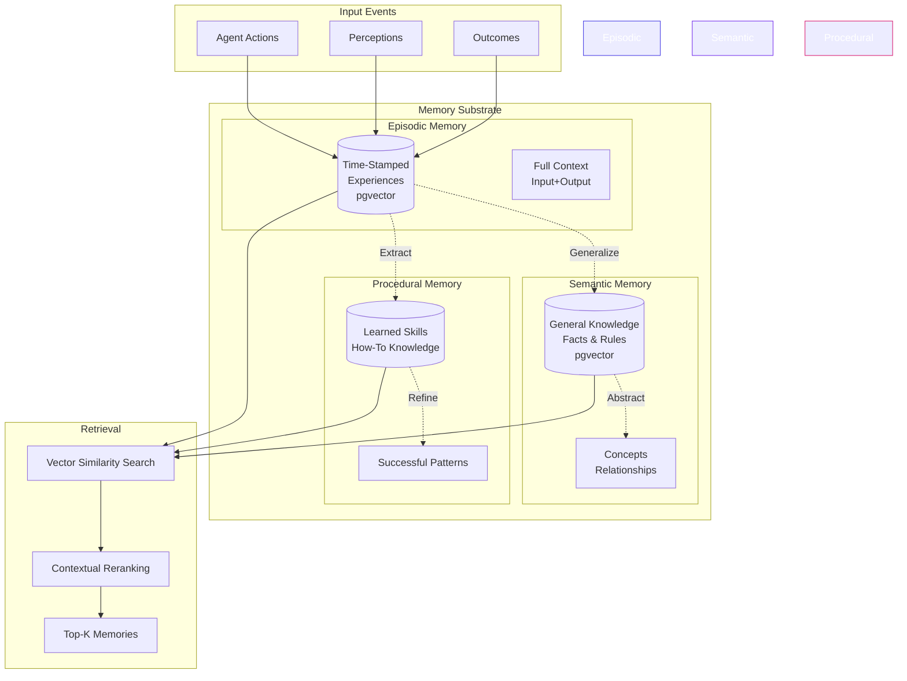
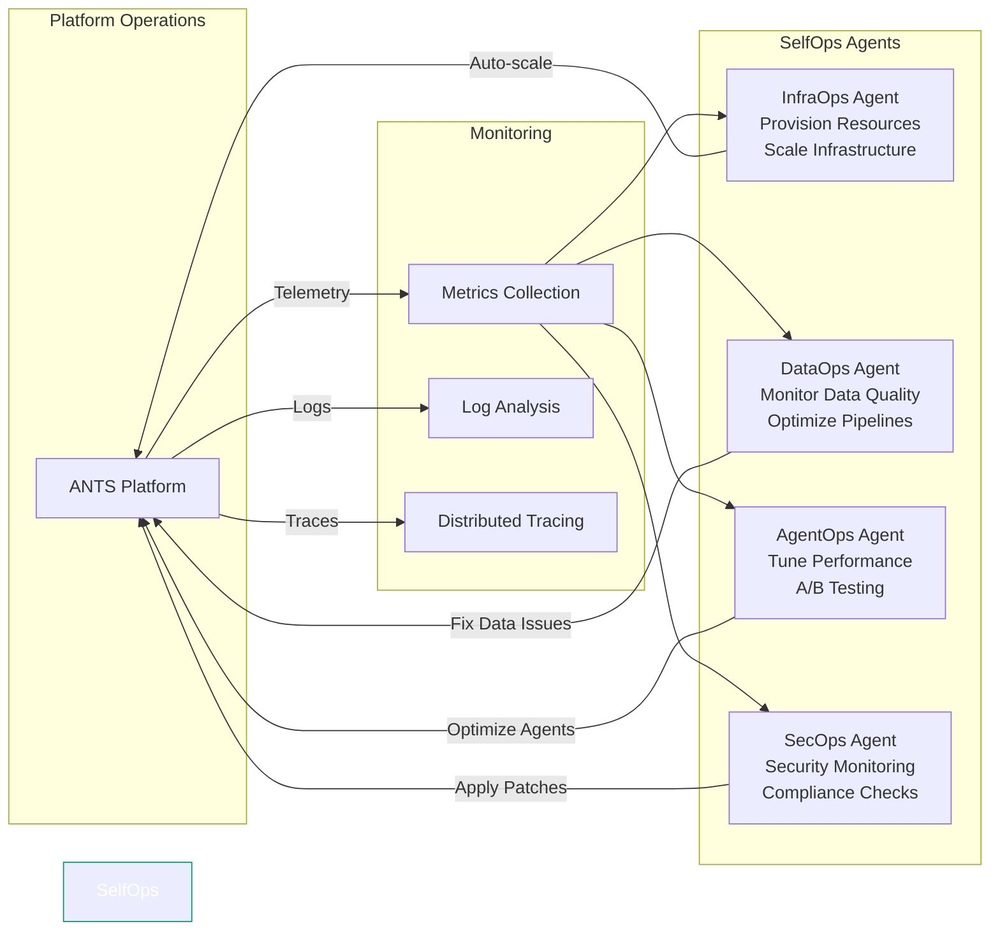
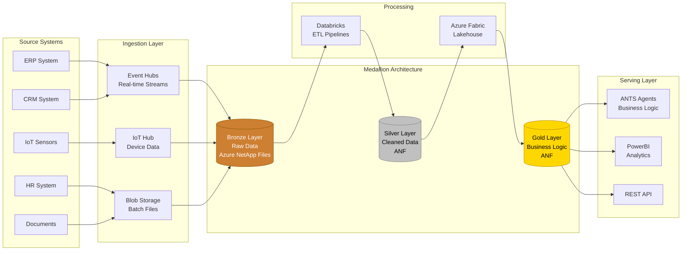

# ANTS Architecture Diagrams

Professional architecture diagrams for ANTS platform.

## 1. High-Level System Architecture

```mermaid
graph TB
    subgraph "User Layer"
        UI[Web Portal]
        Teams[Microsoft Teams]
        API[REST API]
    end

    subgraph "AG-UI Streaming Layer"
        SSE[Server-Sent Events]
        WS[WebSocket Streams]
        DevUI[DevUI Dashboard]
    end

    subgraph "ANTS Core - Biological Intelligence Patterns"
        subgraph "Decision Councils"
            Council[5-Phase Deliberation]
            Consensus[Consensus Engine]
            Vote[Weighted Voting]
        end

        subgraph "Swarm Coordination"
            Pheromone[Pheromone Trails]
            EventHub[Event Hubs]
            Emergence[Emergent Behavior]
        end

        subgraph "Polymorphic Agents"
            Stem[Stem Cell Agents]
            Diff[Differentiation]
            Spec[Specialized Agents]
        end

        subgraph "Meta-Agents"
            CodeGen[Code Generator]
            IntGen[Integration Builder]
            SelfMod[Self-Modification]
        end
    end

    subgraph "Agent Runtime"
        BaseAgent[Base Agent Loop<br/>Perceive→Retrieve→Reason→Execute→Verify→Learn]
        Memory[Memory Substrate<br/>Episodic|Semantic|Procedural]
        Policy[Policy Engine OPA/Rego]
    end

    subgraph "Microsoft Azure AI Stack"
        AIFoundry[Azure AI Foundry<br/>1,400+ Connectors]
        OpenAI[Azure OpenAI]
        NIM[NVIDIA NIM<br/>2.6x faster]
        EntraID[Entra Agent IDs]
    end

    subgraph "Observability - Microsoft Agent Framework"
        OTel[OpenTelemetry Tracing]
        AzMon[Azure Monitor]
        Aspire[Aspire Dashboard]
    end

    subgraph "Data Layer"
        Postgres[(PostgreSQL<br/>pgvector)]
        ANF[Azure NetApp Files<br/>67% cost reduction]
        Fabric[Azure Fabric<br/>Medallion Architecture]
        Databricks[Databricks<br/>ML Pipelines]
    end

    UI --> SSE
    Teams --> SSE
    API --> SSE
    SSE --> Council
    SSE --> Swarm
    SSE --> Stem
    SSE --> Meta

    Council --> BaseAgent
    Swarm --> BaseAgent
    Stem --> BaseAgent
    Meta --> BaseAgent

    BaseAgent --> Memory
    BaseAgent --> Policy
    BaseAgent --> AIFoundry

    AIFoundry --> OpenAI
    AIFoundry --> NIM
    AIFoundry --> EntraID

    BaseAgent --> OTel
    OTel --> AzMon
    OTel --> Aspire

    Memory --> Postgres
    BaseAgent --> ANF
    BaseAgent --> Fabric
    BaseAgent --> Databricks

    WS --> DevUI
    DevUI -.-> BaseAgent

    style ANTS Core - Biological Intelligence Patterns fill:#6366f1,stroke:#4f46e5,color:#fff
    style Microsoft Azure AI Stack fill:#0078d4,stroke:#106ebe,color:#fff
    style Observability - Microsoft Agent Framework fill:#10b981,stroke:#059669,color:#fff
```

## 2. Agent Execution Flow (6-Phase Loop)



## 3. Decision Council Deliberation (5-Phase)



## 4. Swarm Coordination via Pheromone Trails



## 5. Polymorphic Stem Cell Agent Differentiation



## 6. Meta-Agent: Self-Coding Integration Builder



## 7. Memory Substrate - Three-Tier Architecture



## 8. SelfOps - Platform Managing Itself



## 9. Technology Stack - Three Layers

```mermaid
graph TB
    subgraph "Layer 3: ANTS Unique Features"
        Councils[Decision Councils]
        Swarms[Swarm Intelligence]
        StemCells[Polymorphic Agents]
        MetaAgents[Meta-Agents]
        SelfOps[SelfOps Teams]
    end

    subgraph "Layer 2: Microsoft Frameworks"
        AIFoundry[Azure AI Foundry<br/>1,400+ Connectors]
        SemanticKernel[Semantic Kernel<br/>Orchestration]
        AgentFramework[Agent Framework<br/>DevUI + AG-UI]
        OpenTelemetry[OpenTelemetry<br/>Observability]
        EntraID[Entra Agent IDs<br/>Security]
    end

    subgraph "Layer 1: Infrastructure (Azure + NVIDIA + NetApp)"
        AKS[Azure Kubernetes Service]
        NIM[NVIDIA NIM Microservices<br/>2.6x Faster Inference]
        ANF[Azure NetApp Files<br/>Sub-ms Latency, 67% Cost↓]
        Fabric[Azure Fabric Lakehouse]
        Databricks[Databricks ML Pipelines]
        PostgreSQL[(PostgreSQL + pgvector)]
    end

    Councils --> AIFoundry
    Swarms --> AgentFramework
    StemCells --> SemanticKernel
    MetaAgents --> AIFoundry
    SelfOps --> OpenTelemetry

    AIFoundry --> AKS
    SemanticKernel --> NIM
    AgentFramework --> AKS
    OpenTelemetry --> AKS
    EntraID --> AKS

    AKS --> ANF
    NIM --> ANF
    AKS --> Fabric
    AKS --> Databricks
    AKS --> PostgreSQL

    style Layer 3: ANTS Unique Features fill:#6366f1,stroke:#4f46e5,color:#fff
    style Layer 2: Microsoft Frameworks fill:#0078d4,stroke:#106ebe,color:#fff
    style Layer 1: Infrastructure (Azure + NVIDIA + NetApp) fill:#10b981,stroke:#059669,color:#fff
```

## 10. Data Flow - Bronze → Silver → Gold (Medallion)



---

## Diagram Usage in Documentation

These diagrams can be embedded in:
- README.md
- Whitepaper
- GitHub Pages site
- API documentation
- Blog posts
- Technical presentations

All diagrams use Mermaid syntax and will render automatically on GitHub, GitLab, and documentation platforms supporting Mermaid.
